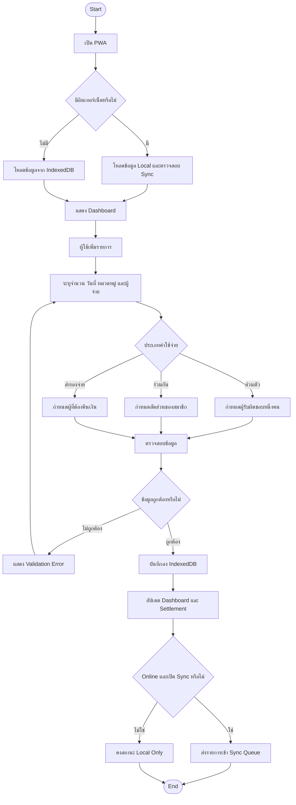
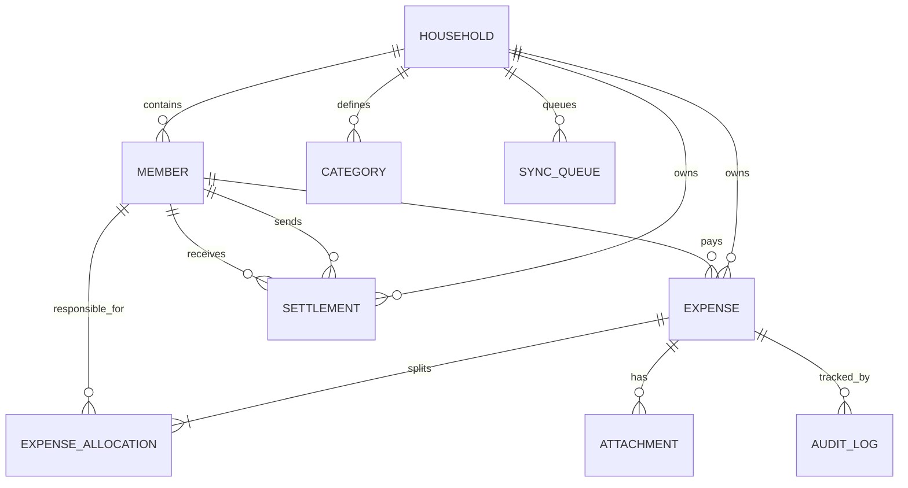
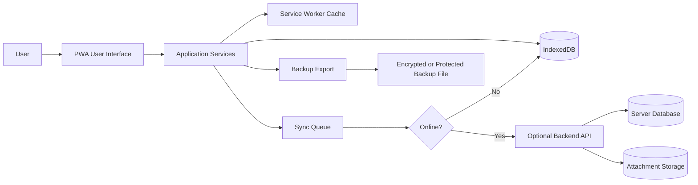

# Family Expense PWA Offline-First

> เอกสาร Product Requirement และ Technical Specification สำหรับแอปบันทึกค่าใช้จ่ายครอบครัวแบบ Progressive Web App (PWA) ที่ใช้งานได้แม้ไม่มีอินเทอร์เน็ต โดยรองรับค่าใช้จ่ายส่วนตัว ค่าใช้จ่ายร่วม การแนบหลักฐาน และการสรุปยอดเคลียร์ระหว่างสมาชิก

---

## 1. Document Control

| รายการ | รายละเอียด |
|---|---|
| Document | Family Expense PWA Offline-First Specification |
| Version | 1.0 |
| Status | Draft for Design and Development |
| Primary User | สมาชิกในครอบครัว |
| Application Type | Progressive Web App (PWA) |
| Data Strategy | Offline-first, local storage as primary working store |

---

## 2. Objective

สร้างแอปบันทึกและติดตามค่าใช้จ่ายครอบครัวที่:

- ติดตั้งบนโทรศัพท์หรือคอมพิวเตอร์ได้เหมือนแอป
- เปิดและบันทึกข้อมูลได้เมื่อไม่มีอินเทอร์เน็ต
- แยกค่าใช้จ่ายตามผู้จ่าย ผู้รับผิดชอบ และประเภทค่าใช้จ่าย
- รองรับค่าใช้จ่ายส่วนตัว ค่าใช้จ่ายร่วม และรายการสำรองจ่ายแทนกัน
- คำนวณยอดที่ต้องเคลียร์ระหว่างสมาชิกในแต่ละเดือน
- แนบรูปใบเสร็จหรือหลักฐานการโอนได้
- เก็บประวัติการแก้ไขและสถานะการชำระคืน
- สำรองและกู้คืนข้อมูลได้
- ป้องกันข้อมูลสูญหายจากการปิดแอปหรือสัญญาณอินเทอร์เน็ตขาดหาย

---

## 3. Business Problem

การบันทึกค่าใช้จ่ายครอบครัวด้วยแชต สมุด หรือ Spreadsheet ทำให้เกิดปัญหา:

- ไม่ทราบยอดที่แต่ละคนจ่ายจริง
- ค่าใช้จ่ายส่วนตัวและค่าใช้จ่ายร่วมปะปนกัน
- ต้องคำนวณยอดคืนเงินด้วยตนเอง
- หลักฐานการจ่ายเงินกระจัดกระจาย
- ข้อมูลไม่พร้อมใช้งานเมื่อไม่มีอินเทอร์เน็ต
- อาจบันทึกรายการซ้ำหรือลืมบันทึก
- ยากต่อการตรวจสอบย้อนหลังและสรุปแนวโน้มรายเดือน

---

## 4. Scope

### 4.1 In Scope

1. จัดการสมาชิกในครอบครัว
2. บันทึก แก้ไข และยกเลิกรายการค่าใช้จ่าย
3. บันทึกรายได้แบบ Optional
4. แยกประเภทค่าใช้จ่าย
5. ระบุผู้จ่ายและผู้รับผิดชอบค่าใช้จ่าย
6. กระจายค่าใช้จ่ายให้สมาชิกแบบเท่ากัน ระบุจำนวน หรือระบุเปอร์เซ็นต์
7. แนบรูปหลักฐาน
8. ค้นหา กรอง และจัดเรียงรายการ
9. Dashboard รายวัน รายเดือน และรายสมาชิก
10. สรุปยอดสำรองจ่ายและยอดที่ต้องเคลียร์
11. บันทึกการชำระคืนหรือการเคลียร์ยอด
12. ใช้งาน Offline
13. Export และ Import ข้อมูลสำรอง
14. Optional Sync เมื่อมี Backend ในอนาคต
15. การแจ้งเตือนภายในแอป

### 4.2 Out of Scope สำหรับ Version 1

- เชื่อมต่อบัญชีธนาคารอัตโนมัติ
- ดึงรายการจากบัตรเครดิตอัตโนมัติ
- OCR ใบเสร็จอัตโนมัติ
- ระบบบัญชีเต็มรูปแบบ
- ระบบภาษี
- การแปลงหลายสกุลเงินแบบ Real-time
- การโอนเงินจริงภายในแอป

---

## 5. Confirmed Information

- แอปต้องเป็น PWA
- แอปต้องใช้งานแบบ Offline ได้
- แอปใช้สำหรับบันทึกค่าใช้จ่าย

## 6. Assumptions

- [ASSUMPTION: เริ่มต้นจากครอบครัวขนาดเล็ก เช่น คู่สมรสและสมาชิกในบ้าน]
- [ASSUMPTION: ใช้สกุลเงินหลักหนึ่งสกุลต่อ Household]
- [ASSUMPTION: Version แรกเก็บข้อมูลในอุปกรณ์ด้วย IndexedDB]
- [ASSUMPTION: รูปหลักฐานถูกเก็บใน IndexedDB หรือ Local File Storage ที่ Browser รองรับ]
- [ASSUMPTION: การ Sync ข้ามอุปกรณ์เป็น Optional และต้องมี Backend เพิ่มเติม]
- [ASSUMPTION: ผู้ใช้ยอมรับว่าการล้าง Browser Data อาจทำให้ข้อมูล Local สูญหาย จึงต้องมี Backup]

## 7. To Be Confirmed

- [TO CONFIRM: APP_NAME]
- [TO CONFIRM: จำนวนสมาชิกสูงสุดต่อ Household]
- [TO CONFIRM: สกุลเงินหลัก]
- [TO CONFIRM: ต้อง Login หรือใช้ Local Profile เท่านั้น]
- [TO CONFIRM: ต้อง Sync ข้ามอุปกรณ์ใน Version แรกหรือไม่]
- [TO CONFIRM: Backend และ Hosting Platform]
- [TO CONFIRM: ระยะเวลาเก็บรูปหลักฐาน]
- [TO CONFIRM: ต้องเข้ารหัสฐานข้อมูล Local หรือไม่]
- [TO CONFIRM: ขนาดไฟล์หลักฐานสูงสุด]

---

## 8. Actors and Roles

| Actor | หน้าที่ | สิทธิ์หลัก |
|---|---|---|
| Household Admin | ตั้งค่าครอบครัว สมาชิก หมวดหมู่ และ Backup | จัดการข้อมูลทั้งหมด |
| Member | บันทึกและติดตามค่าใช้จ่าย | จัดการรายการตามสิทธิ์ |
| Viewer | ดู Dashboard และรายงาน | Read-only |
| Sync Service | Sync ข้อมูลเมื่อ Online | อ่านและส่งข้อมูลตาม Sync Policy |

> หาก Version แรกไม่มี Login ให้ใช้ Device Owner เป็น Household Admin โดยอัตโนมัติ

---

## 9. Expense Types

| Type | คำอธิบาย | ตัวอย่าง |
|---|---|---|
| Personal | ผู้จ่ายรับผิดชอบเอง | ของใช้ส่วนตัว |
| Shared | สมาชิกตั้งแต่สองคนรับผิดชอบร่วมกัน | ค่าอาหารครอบครัว |
| Advance | ผู้หนึ่งสำรองจ่ายแทนอีกคน | จ่ายบิลแทนคู่สมรส |
| Household | ค่าใช้จ่ายส่วนกลางของบ้าน | ค่าน้ำ ค่าไฟ |
| Transfer/Settlement | รายการชำระคืนระหว่างสมาชิก | โอนคืนยอดสิ้นเดือน |
| Income | เงินเข้า Optional | เงินเดือน รายได้เสริม |
| Adjustment | รายการปรับปรุงยอดโดยมีเหตุผล | แก้ยอดยกมา |

---

## 10. TO-BE Process



---

## 11. Functional Requirements

### FR-001 จัดการ Household

- **Requirement:** ระบบต้องให้ผู้ใช้สร้างและแก้ไขข้อมูล Household
- **Input:** ชื่อ Household, สกุลเงินหลัก, วันเริ่มต้นรอบเดือน
- **Processing Rule:** ต้องมี Household อย่างน้อยหนึ่งรายการก่อนบันทึกค่าใช้จ่าย
- **Output:** Household Profile
- **Validation:** ชื่อต้องไม่ว่าง สกุลเงินต้องอยู่ในรายการที่รองรับ
- **Error Message:** `กรุณาระบุชื่อครอบครัวและสกุลเงินหลัก`
- **Priority:** Must Have
- **Acceptance Criteria:** ผู้ใช้สร้าง Household และข้อมูลยังอยู่หลังปิดแล้วเปิดแอปใหม่

### FR-002 จัดการสมาชิก

- **Requirement:** เพิ่ม แก้ไข ปิดใช้งาน และกำหนดสีประจำสมาชิกได้
- **Input:** ชื่อที่แสดง, สี, บทบาท, สถานะ
- **Processing Rule:** สมาชิกที่มีรายการอ้างอิงแล้วต้องไม่ถูกลบถาวร ให้เปลี่ยนเป็น Inactive
- **Output:** Member Master
- **Validation:** ชื่อสมาชิกต้องไม่ซ้ำภายใน Household แบบไม่สนตัวพิมพ์เล็กใหญ่
- **Error Message:** `ชื่อสมาชิกนี้มีอยู่แล้ว`
- **Priority:** Must Have
- **Acceptance Criteria:** สมาชิก Inactive ยังปรากฏในประวัติเดิม แต่เลือกในรายการใหม่ไม่ได้

### FR-003 บันทึกค่าใช้จ่าย

- **Requirement:** ผู้ใช้บันทึกรายการค่าใช้จ่ายได้แม้ Offline
- **Input:** วันที่, จำนวนเงิน, หมวดหมู่, ผู้จ่าย, ประเภท, รายละเอียด, Tags
- **Processing Rule:** สร้าง Local UUID และบันทึกสถานะ `LOCAL_ONLY` หรือ `PENDING_SYNC`
- **Output:** Expense Record และ Allocation Detail
- **Validation:** จำนวนเงินต้องมากกว่า 0 วันที่ต้องถูกต้อง ผู้จ่ายต้อง Active ณ วันที่บันทึก
- **Error Message:** `ไม่สามารถบันทึกรายการได้ กรุณาตรวจสอบข้อมูลที่จำเป็น`
- **Priority:** Must Have
- **Acceptance Criteria:** บันทึกรายการใน Airplane Mode และเรียกดูได้หลังเปิดแอปใหม่

### FR-004 แบ่งค่าใช้จ่าย

- **Requirement:** รองรับการแบ่งแบบ Equal, Exact Amount และ Percentage
- **Input:** สมาชิกและสัดส่วน
- **Processing Rule:** ผลรวม Allocation ต้องเท่ากับยอดรวมรายการ
- **Output:** Allocation ต่อสมาชิก
- **Validation:** Percentage รวมต้องเท่ากับ 100 และ Exact Amount รวมต้องเท่ากับยอดรายการ
- **Error Message:** `ยอดแบ่งค่าใช้จ่ายไม่เท่ากับยอดรวม`
- **Priority:** Must Have
- **Acceptance Criteria:** ระบบไม่อนุญาตบันทึกเมื่อยอด Allocation ไม่สมดุล

### FR-005 แนบหลักฐาน

- **Requirement:** ผู้ใช้ถ่ายรูปหรือเลือกไฟล์หลักฐานได้
- **Input:** รูปภาพหรือ PDF ตามประเภทที่รองรับ
- **Processing Rule:** สร้าง Attachment ID, ลดขนาดรูปตาม Configuration และผูกกับ Expense ID
- **Output:** Attachment Record
- **Validation:** ตรวจสอบชนิดไฟล์ ขนาด และจำนวนไฟล์ต่อรายการ
- **Error Message:** `ไฟล์ไม่รองรับหรือมีขนาดเกินกำหนด`
- **Priority:** Should Have
- **Acceptance Criteria:** เปิดดูหลักฐานได้ขณะ Offline

### FR-006 Dashboard

- **Requirement:** แสดงยอดใช้จ่ายรวม ยอดตามหมวดหมู่ ผู้จ่าย สมาชิก และแนวโน้มรายเดือน
- **Input:** ช่วงวันที่, สมาชิก, หมวดหมู่, สถานะ
- **Processing Rule:** คำนวณจากรายการที่ไม่ถูกยกเลิก
- **Output:** KPI, Summary Card, Chart และรายการล่าสุด
- **Validation:** ยอด Dashboard ต้อง Reconcile กับรายการ Detail
- **Error Message:** `ไม่สามารถคำนวณสรุปได้ กรุณาลองโหลดข้อมูลใหม่`
- **Priority:** Must Have
- **Acceptance Criteria:** ยอดรวม Dashboard เท่ากับผลรวม Detail ภายใต้ Filter เดียวกัน

### FR-007 Settlement

- **Requirement:** คำนวณยอดสุทธิที่สมาชิกต้องจ่ายคืนกัน
- **Input:** Expense, Allocation และ Settlement ที่ยืนยันแล้ว
- **Processing Rule:** คำนวณยอดจ่ายจริงลบยอดที่ควรรับผิดชอบ แล้วสร้างคำแนะนำการเคลียร์ยอด
- **Output:** Net Balance และ Proposed Transfer
- **Validation:** ผลรวม Net Balance ของสมาชิกทั้งหมดต้องเท่ากับ 0 ภายในค่าคลาดเคลื่อนการปัดเศษ
- **Error Message:** `ยอดเคลียร์ไม่สมดุล กรุณาตรวจสอบรายการปรับปรุง`
- **Priority:** Must Have
- **Acceptance Criteria:** เมื่อบันทึกการโอนคืน ยอดค้างต้องลดลงตามจำนวนที่ชำระ

### FR-008 ปิดรอบเดือน

- **Requirement:** ผู้ใช้ตรวจสอบและปิดรอบค่าใช้จ่ายรายเดือนได้
- **Input:** เดือน, หมายเหตุ, ผู้ดำเนินการ
- **Processing Rule:** รายการในรอบที่ปิดแล้วแก้ไขไม่ได้ ยกเว้น Reopen โดย Admin
- **Output:** Closed Period Record
- **Validation:** ต้องไม่มีรายการ Draft หรือ Allocation ไม่สมดุล
- **Error Message:** `ไม่สามารถปิดรอบได้ เนื่องจากยังมีรายการที่ต้องตรวจสอบ`
- **Priority:** Should Have
- **Acceptance Criteria:** รายการในรอบปิดแสดง Read-only และมี Audit Log

### FR-009 ค้นหาและกรอง

- **Requirement:** ค้นหาจากรายละเอียด Tags หมวดหมู่ สมาชิก และช่วงวันที่ได้
- **Input:** Search Text และ Filters
- **Processing Rule:** ค้นหาจาก Local Database โดยไม่ต้องใช้อินเทอร์เน็ต
- **Output:** รายการที่ตรงเงื่อนไข
- **Validation:** กรองหลายเงื่อนไขพร้อมกันได้
- **Error Message:** ไม่มี ให้แสดง Empty State
- **Priority:** Must Have
- **Acceptance Criteria:** ผลลัพธ์เปลี่ยนตาม Filter และล้าง Filter ได้ในครั้งเดียว

### FR-010 Backup และ Restore

- **Requirement:** Export ข้อมูลเป็นไฟล์ Backup และ Import เพื่อกู้คืนได้
- **Input:** Local Database และไฟล์ Backup
- **Processing Rule:** ตรวจสอบ Schema Version และ Checksum ก่อน Import
- **Output:** Backup File หรือ Restore Result
- **Validation:** ห้าม Import ไฟล์ผิดรูปแบบหรือเวอร์ชันที่ไม่รองรับ
- **Error Message:** `ไฟล์สำรองไม่ถูกต้องหรือไม่รองรับ`
- **Priority:** Must Have
- **Acceptance Criteria:** Backup แล้วล้างข้อมูลทดสอบ จากนั้น Restore ได้ครบทั้งรายการและความสัมพันธ์

### FR-011 Offline Queue และ Sync

- **Requirement:** เมื่อมี Backend ระบบต้อง Queue การเปลี่ยนแปลงขณะ Offline และ Sync เมื่อ Online
- **Input:** Create, Update, Delete Operation
- **Processing Rule:** ใช้ Client-generated UUID, Updated Timestamp, Version และ Idempotency Key
- **Output:** Sync Status ต่อ Record
- **Validation:** Operation เดิมต้องไม่ถูกประมวลผลซ้ำ
- **Error Message:** `ซิงก์ไม่สำเร็จ ข้อมูลยังถูกเก็บไว้ในอุปกรณ์`
- **Priority:** Should Have
- **Acceptance Criteria:** ปิดอินเทอร์เน็ต บันทึกข้อมูล เปิดอินเทอร์เน็ต แล้วรายการถูก Sync โดยไม่ซ้ำ

### FR-012 Conflict Resolution

- **Requirement:** รองรับกรณีข้อมูลเดียวกันถูกแก้จากหลายอุปกรณ์
- **Input:** Local Version และ Server Version
- **Processing Rule:** ห้ามเขียนทับโดยไม่แจ้ง ผู้ใช้ต้องเลือก Local, Server หรือ Merge ตาม Field ที่รองรับ
- **Output:** Resolved Record พร้อม Audit Trail
- **Validation:** ต้องเก็บสำเนาก่อน Resolve
- **Error Message:** `พบข้อมูลเวอร์ชันใหม่จากอีกอุปกรณ์ กรุณาเลือกข้อมูลที่ต้องการเก็บ`
- **Priority:** Should Have
- **Acceptance Criteria:** Conflict ไม่ทำให้ข้อมูลเวอร์ชันใดสูญหายก่อนผู้ใช้ตัดสินใจ

---

## 12. Business Rules

| ID | Rule |
|---|---|
| BR-001 | รายการค่าใช้จ่ายทุกรายการต้องมี Local UUID ที่ไม่ซ้ำ |
| BR-002 | Amount ต้องมากกว่า 0 ยกเว้น Adjustment ที่กำหนดเหตุผลและสิทธิ์เฉพาะ |
| BR-003 | Total Allocation หลังปัดเศษต้องเท่ากับ Expense Amount |
| BR-004 | ผู้จ่ายสามารถต่างจากผู้รับผิดชอบค่าใช้จ่ายได้ |
| BR-005 | รายการ Settlement ต้องอ้างอิงผู้จ่าย ผู้รับ และวันที่อย่างชัดเจน |
| BR-006 | รายการที่ Sync แล้วและถูกลบให้ใช้ Soft Delete เพื่อรองรับการ Sync |
| BR-007 | Period ที่ปิดแล้วแก้ไขไม่ได้จนกว่าจะ Reopen |
| BR-008 | Attachment ต้องไม่ถูกลบทันทีหาก Expense ยังอ้างอิงอยู่ |
| BR-009 | การ Retry Sync ต้องเป็น Idempotent และไม่สร้างข้อมูลซ้ำ |
| BR-010 | Dashboard ไม่นับรายการ Draft, Voided หรือ Soft Deleted |
| BR-011 | การปัดเศษให้ใช้จำนวนทศนิยมของสกุลเงินหลัก |
| BR-012 | รายการที่เกิดขณะ Offline ต้องแสดงสถานะ Sync ให้ผู้ใช้เห็น |

---

## 13. Data Requirements

> ชื่อตารางและฟิลด์ด้านล่างเป็น Logical Model ไม่ใช่ชื่อจริงสำหรับ Production

### 13.1 Logical Entities



### 13.2 Suggested Logical Fields

#### Household

- householdId: UUID
- name: String
- baseCurrency: String
- monthStartDay: Integer
- createdAt: DateTime
- updatedAt: DateTime
- version: Integer

#### Member

- memberId: UUID
- householdId: UUID
- displayName: String
- role: Enum
- color: String
- status: Active/Inactive
- createdAt: DateTime
- updatedAt: DateTime

#### Expense

- expenseId: UUID
- householdId: UUID
- expenseDate: Date
- amount: Decimal
- currency: String
- categoryId: UUID
- paidByMemberId: UUID
- expenseType: Enum
- description: String
- status: Draft/Active/Voided
- syncStatus: LocalOnly/Pending/Synced/Conflict/Error
- clientUpdatedAt: DateTime
- serverUpdatedAt: DateTime Optional
- version: Integer
- deletedAt: DateTime Optional

#### ExpenseAllocation

- allocationId: UUID
- expenseId: UUID
- memberId: UUID
- allocationType: Equal/Exact/Percentage
- percentage: Decimal Optional
- allocatedAmount: Decimal

#### Attachment

- attachmentId: UUID
- expenseId: UUID
- fileName: String
- mimeType: String
- fileSize: Integer
- blob: Binary/Blob
- checksum: String
- createdAt: DateTime

#### Settlement

- settlementId: UUID
- householdId: UUID
- fromMemberId: UUID
- toMemberId: UUID
- amount: Decimal
- settlementDate: Date
- status: Draft/Confirmed/Voided
- proofAttachmentId: UUID Optional
- note: String

#### SyncQueue

- queueId: UUID
- entityType: String
- entityId: UUID
- operation: Create/Update/Delete
- payload: JSON
- idempotencyKey: UUID
- retryCount: Integer
- nextRetryAt: DateTime
- status: Pending/Processing/Completed/Error/DeadLetter
- lastError: String Optional

---

## 14. Offline-First Architecture



### 14.1 Local Storage Strategy

- ใช้ `IndexedDB` สำหรับ Structured Data และ Blob
- ใช้ `Cache Storage` สำหรับ App Shell, CSS, JavaScript, Icons และ Static Assets
- หลีกเลี่ยงการใช้ `localStorage` เป็นฐานข้อมูลหลัก
- เขียนข้อมูลลง IndexedDB ให้สำเร็จก่อนอัปเดตหน้าจอเป็น Saved
- ใช้ Database Migration ตาม Schema Version
- ตรวจสอบ Storage Quota และแจ้งเตือนก่อนพื้นที่เต็ม

### 14.2 Service Worker Strategy

| Resource | Strategy |
|---|---|
| App Shell | Cache First |
| Static Assets | Stale While Revalidate |
| Local Data | IndexedDB Only |
| API Read | Network First with Local Fallback |
| API Write | Local Write + Background Queue |
| Attachment Upload | Queue with Retry |

### 14.3 Sync State

```text
LOCAL_ONLY -> PENDING_SYNC -> SYNCING -> SYNCED
                                  |-> ERROR -> PENDING_SYNC
                                  |-> CONFLICT -> RESOLVED -> PENDING_SYNC
                                  |-> DEAD_LETTER
```

### 14.4 Retry Policy

- Retry เฉพาะ Error ที่มีโอกาสสำเร็จเมื่อทำใหม่ เช่น Network Error หรือ Server Temporary Error
- ไม่ Retry อัตโนมัติสำหรับ Validation Error หรือ Unauthorized
- ใช้ Exponential Backoff พร้อม Maximum Retry ตาม Configuration
- เก็บ Error Detail โดยไม่เก็บ Secret หรือข้อมูลอ่อนไหวเกินจำเป็น
- ให้ผู้ใช้กด Retry ด้วยตนเองได้

---

## 15. UI and Navigation

### 15.1 Bottom Navigation

1. Dashboard
2. Transactions
3. Add Expense
4. Settlement
5. Settings

### 15.2 Main Screens

#### Dashboard

- ยอดใช้จ่ายเดือนปัจจุบัน
- เปรียบเทียบเดือนก่อน
- ยอดตามหมวดหมู่
- ยอดที่แต่ละคนจ่าย
- ยอดคงค้างระหว่างสมาชิก
- รายการล่าสุด
- Offline/Sync Status Indicator

#### Add Expense

- Amount เป็นจุดเด่นและเข้าถึงง่าย
- วันที่
- หมวดหมู่
- ผู้จ่าย
- ประเภทค่าใช้จ่าย
- ผู้รับผิดชอบและวิธีแบ่ง
- รายละเอียดและ Tags
- แนบหลักฐาน
- Save Draft / Save

#### Transactions

- Search
- Filters
- Group by Date
- แสดง Paid By, Amount, Category และ Sync Status
- Swipe Action หรือ Action Menu สำหรับ Edit, Duplicate, Void

#### Settlement

- Net Balance ต่อสมาชิก
- Suggested Transfers
- Record Payment
- ประวัติการชำระ
- ปิดรอบเดือน

#### Settings

- Household
- Members
- Categories
- Currency
- Backup and Restore
- Sync
- Storage Usage
- Security
- About and Version

---

## 16. Validation Rules

| ID | Validation | Expected Result |
|---|---|---|
| VAL-001 | Amount ว่างหรือไม่ใช่ตัวเลข | ไม่ให้บันทึก |
| VAL-002 | Amount เท่ากับหรือน้อยกว่า 0 | ไม่ให้บันทึก ยกเว้น Rule เฉพาะ |
| VAL-003 | ไม่เลือกผู้จ่าย | ไม่ให้บันทึก |
| VAL-004 | ไม่มี Allocation | ไม่ให้บันทึก Shared/Advance |
| VAL-005 | Allocation รวมไม่เท่ากับ Amount | แสดงส่วนต่าง |
| VAL-006 | Percentage รวมไม่เท่ากับ 100 | ไม่ให้บันทึก |
| VAL-007 | วันที่ไม่ถูกต้อง | ไม่ให้บันทึก |
| VAL-008 | วันที่อยู่ใน Closed Period | แสดง Read-only หรือขอ Reopen |
| VAL-009 | Attachment ไม่รองรับ | ปฏิเสธไฟล์ |
| VAL-010 | Storage Quota ใกล้เต็ม | แจ้งเตือนและแนะนำ Backup |
| VAL-011 | Backup Schema ไม่รองรับ | ไม่ Import และไม่แก้ข้อมูลปัจจุบัน |
| VAL-012 | Duplicate Idempotency Key | ไม่สร้างรายการซ้ำ |

---

## 17. Duplicate Handling

### Duplicate Definition

รายการอาจเป็น Duplicate Candidate เมื่อมีข้อมูลต่อไปนี้เหมือนกัน:

- Household
- วันที่
- จำนวนเงิน
- ผู้จ่าย
- หมวดหมู่
- รายละเอียดใกล้เคียงกัน

### Behavior

1. ระบบแจ้งเตือนก่อนบันทึก แต่ไม่ Block โดยอัตโนมัติ
2. ผู้ใช้เลือก `บันทึกต่อ`, `เปิดรายการเดิม` หรือ `ยกเลิก`
3. การ Sync ใช้ UUID และ Idempotency Key เป็น Duplicate Control หลัก
4. ห้าม Merge รายการโดยอัตโนมัติโดยไม่มีการยืนยัน

---

## 18. Security and Privacy

- ไม่ Hardcode Password, Token หรือ API Secret ใน PWA
- หากมี Backend ให้ใช้มาตรฐาน Authentication ที่เหมาะสม
- ใช้ HTTPS สำหรับทุก Network Communication
- จำกัดข้อมูลที่เก็บใน Log
- Mask ข้อมูลส่วนบุคคลใน Error Report
- ล็อกแอปด้วย PIN หรือ Biometric เป็น Optional โดยขึ้นกับ Browser/Platform Support
- Backup ที่มีข้อมูลส่วนบุคคลควรมีตัวเลือกเข้ารหัสด้วยรหัสผ่าน
- Token ต้องไม่ถูกเก็บใน Plain Text ที่ JavaScript เข้าถึงได้ หาก Architecture รองรับทางเลือกที่ปลอดภัยกว่า
- ใช้ Content Security Policy และป้องกัน Cross-Site Scripting
- ตรวจสอบ Dependency Vulnerability ก่อน Release

> หมายเหตุ: PWA แบบ Local-only ไม่ควรถูกมองว่าเป็น Backup ระยะยาว ผู้ใช้ต้อง Export Backup เป็นระยะ

---

## 19. Audit and Logging

### Audit Log

เก็บเหตุการณ์สำคัญ:

- Create Expense
- Update Expense
- Void Expense
- Create Settlement
- Confirm Settlement
- Close/Reopen Period
- Import/Restore
- Conflict Resolution

### Technical Log

- App Version
- Timestamp
- Operation
- Entity Type และ Masked Entity ID
- Result
- Error Code
- Retry Count
- Network State

ห้ามเก็บ:

- Password
- Access Token
- รูปหลักฐานเต็มใน Log
- ข้อมูลส่วนบุคคลที่ไม่จำเป็น

---

## 20. Non-Functional Requirements

| ID | Category | Requirement | Measurement | Acceptance Criteria |
|---|---|---|---|---|
| NFR-001 | Offline | ฟังก์ชันหลักต้องทำงานโดยไม่มีอินเทอร์เน็ต | Manual Offline Test | เพิ่ม แก้ไข ค้นหา และดู Dashboard ได้ |
| NFR-002 | Performance | เปิด App Shell จาก Cache ได้รวดเร็ว | Device Test | ไม่มี Network Dependency สำหรับหน้าเริ่มต้นหลังติดตั้ง |
| NFR-003 | Reliability | การปิดแอประหว่าง Save ต้องไม่สร้างข้อมูลครึ่งรายการ | Transaction Test | Expense และ Allocation สำเร็จหรือยกเลิกทั้งชุด |
| NFR-004 | Data Integrity | Dashboard ต้องตรงกับ Detail | Reconciliation | Difference เท่ากับ 0 ตามกฎปัดเศษ |
| NFR-005 | Security | Network Traffic ต้องเข้ารหัส | Security Test | ใช้ HTTPS เท่านั้นเมื่อมี Backend |
| NFR-006 | Maintainability | แยก UI, Domain, Storage และ Sync Layer | Code Review | Dependency ระหว่าง Layer เป็นไปตาม Architecture |
| NFR-007 | Compatibility | รองรับ Browser เป้าหมายที่กำหนด | Compatibility Matrix | ผ่าน Test บน Browser ที่อนุมัติ |
| NFR-008 | Recoverability | Restore Backup ได้โดยไม่ทำลายข้อมูลเดิมเมื่อ Validation ไม่ผ่าน | Restore Test | Failed Import ต้อง Rollback ทั้งหมด |
| NFR-009 | Accessibility | Form ใช้งานด้วย Keyboard และ Screen Reader ได้ในระดับพื้นฐาน | Accessibility Test | Label, Focus และ Contrast ผ่านเกณฑ์ที่กำหนด |
| NFR-010 | Observability | ผู้ใช้เห็นสถานะ Local, Pending, Synced, Conflict และ Error | UI Test | ทุก Record ที่ต้อง Sync มีสถานะชัดเจน |

---

## 21. Error Handling

| Scenario | System Behavior | User Message |
|---|---|---|
| IndexedDB Write Failed | Rollback Transaction และเก็บ Error Code | บันทึกไม่สำเร็จ กรุณาตรวจสอบพื้นที่จัดเก็บ |
| Storage Full | หยุดรับไฟล์ใหม่ แต่ให้ดูข้อมูลเดิม | พื้นที่จัดเก็บใกล้เต็ม กรุณาสำรองข้อมูลหรือลบไฟล์ที่ไม่จำเป็น |
| Network Lost During Sync | คง Queue และ Retry ภายหลัง | ข้อมูลถูกเก็บไว้ในอุปกรณ์และจะซิงก์เมื่อออนไลน์ |
| Authentication Expired | หยุด Sync แต่ไม่ลบ Local Data | กรุณาเข้าสู่ระบบใหม่เพื่อซิงก์ข้อมูล |
| Validation Failed | ไม่บันทึก Record | กรุณาตรวจสอบข้อมูลที่ไฮไลต์ |
| Conflict | เก็บทั้ง Local และ Server Version | พบข้อมูลขัดแย้ง กรุณาเลือกเวอร์ชัน |
| Corrupt Backup | ยกเลิก Import ทั้งหมด | ไฟล์สำรองเสียหายหรือไม่ถูกต้อง |
| Attachment Upload Failed | เก็บ Attachment ใน Queue | หลักฐานยังไม่ซิงก์ แต่ยังอยู่ในอุปกรณ์นี้ |

---

## 22. Transaction Handling

การบันทึก Expense ต้องทำใน Logical Transaction เดียว:

1. Validate Header
2. Validate Allocation
3. Generate UUID
4. Save Expense
5. Save Allocations
6. Save Attachment Metadata
7. Create Audit Log
8. Create Sync Queue Entry
9. Commit

หากขั้นตอนใดล้มเหลว:

- Rollback การเปลี่ยนแปลงของรายการนั้นทั้งหมด
- ไม่แสดงสถานะ Saved
- เก็บ Technical Error แบบ Masked
- ให้ผู้ใช้ Retry โดยไม่สร้าง Duplicate

---

## 23. Backup and Recovery

### Backup Content

- Household
- Members
- Categories
- Expenses
- Allocations
- Settlements
- Attachments ตาม Option
- Audit Metadata
- Schema Version
- Export Timestamp
- Checksum

### Restore Modes

1. **Validate Only**: ตรวจสอบไฟล์โดยไม่แก้ข้อมูล
2. **Replace Local Data**: สำรองข้อมูลปัจจุบันก่อนแทนที่
3. **Merge**: รวมตาม UUID และ Version โดยต้องแสดง Conflict

### Recovery Control

- ก่อน Restore ให้สร้าง Snapshot ของข้อมูลปัจจุบัน
- Failed Restore ต้องไม่เปลี่ยนข้อมูลเดิม
- หลัง Restore ให้ทำ Reconciliation
- แสดงจำนวน Record ที่ Success, Skipped, Conflict และ Error

---

## 24. Suggested Technology Stack

> เป็นข้อเสนอเพิ่มเติมจาก AI และปรับได้ตามมาตรฐานทีม

| Layer | Option |
|---|---|
| Frontend | React + TypeScript หรือ Vue + TypeScript |
| Build Tool | Vite |
| PWA | Workbox หรือ PWA Plugin ที่รองรับ Service Worker |
| Local Database | IndexedDB ผ่าน Dexie.js |
| State Management | Lightweight Store ตาม Framework |
| Validation | Schema-based Validation Library |
| Charts | Lightweight Chart Library |
| Testing | Unit, Component, E2E และ Offline Test |
| Optional Backend | REST API หรือ Managed Backend |
| Attachment Storage | Object Storage เมื่อเปิด Sync |

### Suggested Folder Structure

```text
src/
  app/
  components/
  features/
    dashboard/
    expenses/
    settlements/
    settings/
  domain/
    entities/
    services/
    rules/
  infrastructure/
    db/
    sync/
    backup/
    logging/
  pwa/
    service-worker/
  shared/
    validation/
    formatting/
    types/
  tests/
```

---

## 25. UAT Scenarios

| ID | Scenario | Expected Result |
|---|---|---|
| UAT-001 | ติดตั้ง PWA และเปิด Offline | App Shell เปิดได้ |
| UAT-002 | บันทึกค่าอาหารส่วนกลาง Offline | รายการถูกบันทึกและ Dashboard อัปเดต |
| UAT-003 | แบ่งค่าใช้จ่าย 50/50 | Allocation รวมเท่ากับยอดรายการ |
| UAT-004 | แบ่ง Exact Amount ไม่ครบ | ระบบไม่ให้บันทึก |
| UAT-005 | แนบรูปหลักฐาน Offline | เปิดดูรูปได้โดยไม่ใช้อินเทอร์เน็ต |
| UAT-006 | เปิดอินเทอร์เน็ตหลังสร้างรายการ Offline | รายการเปลี่ยนเป็น Synced โดยไม่ซ้ำ |
| UAT-007 | แก้รายการเดียวกันสองอุปกรณ์ | ระบบแสดง Conflict ไม่เขียนทับเงียบ ๆ |
| UAT-008 | บันทึกการโอนคืน | ยอดค้างระหว่างสมาชิกลดลง |
| UAT-009 | ปิดรอบเดือน | รายการในรอบแก้ไขไม่ได้ |
| UAT-010 | Export และ Restore | ข้อมูลและความสัมพันธ์กลับมาครบ |
| UAT-011 | Import ไฟล์เสีย | ข้อมูลปัจจุบันไม่เปลี่ยน |
| UAT-012 | Browser Storage ใกล้เต็ม | ระบบแจ้งเตือนและไม่ทำข้อมูลเดิมเสียหาย |
| UAT-013 | Reconcile Dashboard กับ Detail | ยอดตรงกันภายใต้ Filter เดียวกัน |
| UAT-014 | Delete รายการที่ Sync แล้ว | ใช้ Soft Delete และไม่กลับมาหลัง Sync |
| UAT-015 | Retry Operation เดิม | ไม่เกิด Duplicate |

---

## 26. Acceptance Criteria Summary

แอปพร้อมสำหรับ MVP เมื่อ:

- ติดตั้งเป็น PWA ได้
- เปิดใช้งานหลังโหลดครั้งแรกโดยไม่มีอินเทอร์เน็ตได้
- เพิ่ม แก้ไข Void และค้นหารายการ Offline ได้
- รองรับ Personal, Shared และ Advance Expense
- Allocation Reconcile กับยอดรายการทุกครั้ง
- Dashboard Reconcile กับ Detail
- คำนวณ Settlement ได้และบันทึกการคืนเงินได้
- Backup และ Restore ผ่านการทดสอบ
- ปิดแอปหรือ Reload แล้วข้อมูลไม่สูญหาย
- Error สำคัญมีข้อความที่ผู้ใช้เข้าใจและมี Recovery Path
- ไม่มี Secret หรือ Credential ถูกฝังใน Source Code

---

## 27. Risks and Mitigation

| Risk | Impact | Mitigation |
|---|---|---|
| ผู้ใช้ล้าง Browser Data | ข้อมูล Local สูญหาย | แจ้งเตือนและสร้าง Backup Reminder |
| Storage Quota จำกัด | แนบหลักฐานไม่ได้ | Compress Image, Quota Monitor, Export/Archive |
| Browser Support ต่างกัน | PWA Behavior ไม่เหมือนกัน | กำหนด Compatibility Matrix และทดสอบอุปกรณ์จริง |
| Sync Conflict | ข้อมูลถูกเขียนทับ | Versioning, Conflict UI และ Audit Trail |
| Duplicate จาก Retry | ยอดซ้ำ | UUID และ Idempotency Key |
| ปัดเศษไม่สมดุล | Settlement ผิด | Centralized Rounding Rule และ Reconciliation |
| Backup ไม่ปลอดภัย | ข้อมูลส่วนตัวรั่วไหล | Optional Encryption และคำเตือนผู้ใช้ |
| Attachment ใหญ่ | App ช้าและพื้นที่เต็ม | Resize, Compression และ File Limit |
| Offline Cache เก่า | ใช้ App Version ไม่ตรง | Versioned Cache และ Controlled Update Prompt |

---

## 28. Recommended Delivery Phases

### Phase 1: Local Offline MVP

- Household และ Member
- Expense และ Allocation
- Categories
- Dashboard
- Settlement Calculation
- IndexedDB
- Service Worker
- Backup/Restore

### Phase 2: Usability and Control

- Attachments
- Duplicate Warning
- Closed Period
- Audit Log
- Storage Monitor
- Enhanced Dashboard

### Phase 3: Multi-Device Sync

- Authentication
- Backend API
- Sync Queue
- Conflict Resolution
- Attachment Upload
- Server-side Backup

### Phase 4: Intelligent Features

- OCR ใบเสร็จพร้อม Confidence Threshold
- Human Review
- Auto Categorization
- Budget and Alerts
- Recurring Expense
- Data Insight

---

## 29. ข้อเสนอเพิ่มเติมจาก AI

1. เพิ่ม `Quick Add` สำหรับค่าใช้จ่ายที่ใช้บ่อย
2. เพิ่ม `Recurring Expense` สำหรับค่าน้ำ ค่าไฟ อินเทอร์เน็ต และค่าเล่าเรียน
3. เพิ่ม Budget ต่อหมวดหมู่พร้อมเตือนเมื่อใกล้เกินวงเงิน
4. เพิ่ม Monthly Closing Checklist ก่อนปิดรอบ
5. เพิ่ม Data Quality Indicator เช่น รายการไม่มีหมวด ไม่มีหลักฐาน หรือยังไม่ Sync
6. เพิ่ม Read-only Demo Data แยกจากข้อมูลจริงสำหรับทดสอบ UI
7. เพิ่ม Export CSV สำหรับวิเคราะห์ต่อใน Excel หรือ Power BI
8. เพิ่ม Emergency Recovery Code หรือ Secure Backup Guidance หากใช้หลายอุปกรณ์

---

## 30. Development Checklist

- [ ] Confirm Product Name
- [ ] Confirm Target Browsers and Devices
- [ ] Confirm Local-only หรือ Multi-device Sync
- [ ] Finalize Data Model
- [ ] Finalize Rounding Rule
- [ ] Define Storage and Attachment Limits
- [ ] Design Wireframes
- [ ] Implement IndexedDB Migration
- [ ] Implement Service Worker Update Strategy
- [ ] Implement Transaction-safe Save
- [ ] Implement Backup Validate-only Mode
- [ ] Implement Duplicate and Idempotency Control
- [ ] Implement Sync Status UI
- [ ] Perform Offline UAT
- [ ] Perform Restore and Corrupt Backup Test
- [ ] Perform Security Review
- [ ] Prepare Deployment and Rollback Plan

---

## 31. Definition of Done

Feature หนึ่งถือว่าเสร็จเมื่อ:

- Requirement และ Acceptance Criteria ผ่าน
- Unit Test และ Integration Test ผ่าน
- Offline Scenario ผ่าน
- Error Path และ Retry ผ่าน
- Data Migration Impact ถูกตรวจสอบ
- Logging ไม่เปิดเผยข้อมูลสำคัญ
- UI รองรับ Empty, Loading, Offline และ Error State
- Documentation ถูกปรับให้ตรงกับ Implementation
- ไม่มี Open Defect ระดับ Critical หรือ High

---

## 32. Open Questions

1. Version แรกต้องใช้ได้กี่อุปกรณ์ต่อครอบครัว?
2. ต้องมี Account/Login หรือ Local PIN เท่านั้น?
3. ต้อง Sync แบบ Real-time หรือ Manual Sync?
4. ต้องรองรับสกุลเงินเดียวหรือหลายสกุล?
5. นิยามรอบเดือนเริ่มวันที่ 1 เสมอหรือกำหนดเองได้?
6. Settlement ต้อง Optimize จำนวนครั้งการโอนหรือแสดงตามรายการจริง?
7. ต้องเก็บหลักฐานกี่ปี?
8. Backup ต้องรวมรูปทั้งหมดหรือเลือกได้?
9. ต้อง Export รูปแบบใดบ้าง เช่น CSV, Excel, PDF หรือ JSON?
10. ต้องรองรับภาษาไทยและอังกฤษตั้งแต่ MVP หรือไม่?

